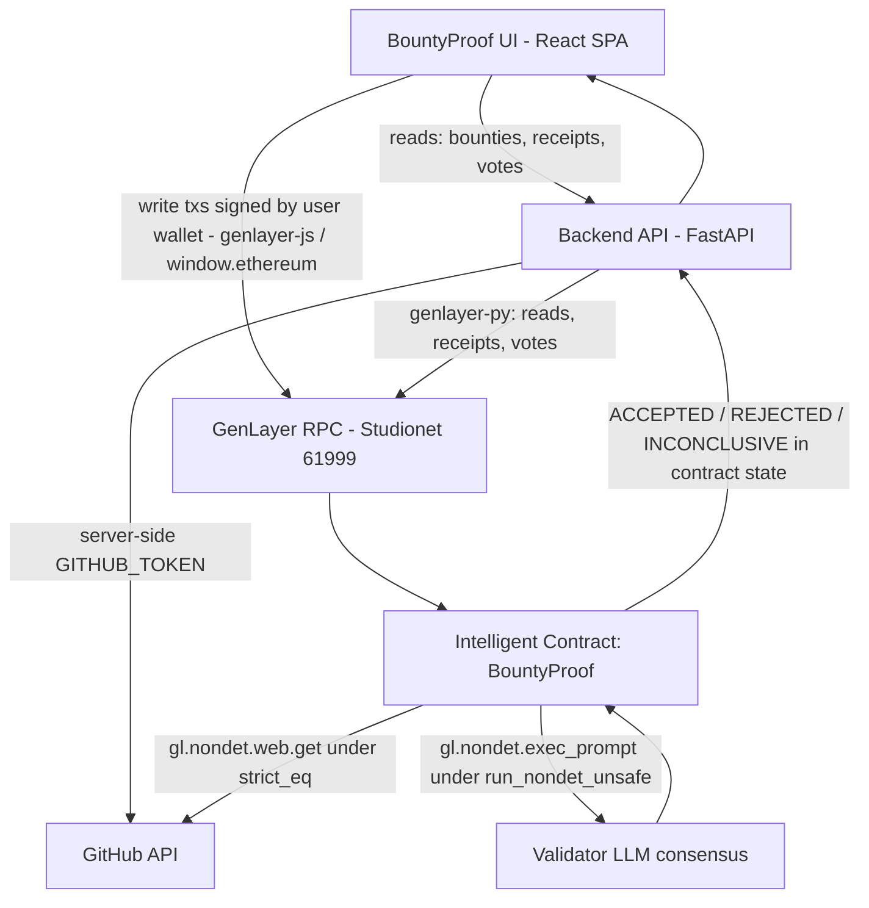

# BountyProof

**Evidence-based acceptance for software bounties.**

BountyProof is a trust layer for software bounties. A bounty creator publishes explicit
acceptance criteria for a GitHub repository task. A contributor submits a pull request. A
GenLayer **Intelligent Contract** retrieves the GitHub evidence on-chain, adjudicates each
criterion under validator consensus, and records the final **ACCEPTED / REJECTED /
INCONCLUSIVE** decision in contract state.

The product is not "AI code review". It is **neutral contractual adjudication of whether a
software bounty was fulfilled** — with a decision anyone can read from the chain.

---

## The trust problem

Software bounties have an uncomfortable middle:

- The contributor says: "I completed the requirements."
- The sponsor says: "This isn't what we agreed."

Without a shared record, disputes drift into weeks of subjective back-and-forth. BountyProof
pins the agreement (criteria + deadline) before work happens, collects the evidence from
GitHub at adjudication time, and stores the ruling where neither side can move it.

## Why GenLayer

A bounty decision is a judgment over unstructured evidence (a PR payload, commit subjects,
a description) against natural-language criteria. That judgment must be **neutral** (neither
party controls it) and **reproducible** (independently re-derivable). GenLayer provides both:

- The adjudication runs *inside* an Intelligent Contract — the LLM call, the web fetches and
  the decision rules are part of the on-chain transaction.
- Every validator re-executes the same evaluation. Web fetches are compared under
  `gl.eq_principle.strict_eq` (identical evidence for all validators); the LLM verdicts are
  validated structurally under `gl.vm.run_nondet_unsafe` (consensus on shape + validity, not
  on exact tokens).
- Only a `MAJORITY_AGREE` outcome updates state. A failed consensus round is reported
  honestly as a failed evaluation — it is never silently retried into a fabricated result.

## Architecture



**The contract is the single source of truth.** The backend never accepts or returns a
client-declared decision; the frontend renders contract state and receipt data only. The
SQLite index on the backend is a discovery aid (bounty id ↔ transaction hashes) and is
validated against the chain before use.

### Repository layout

```
contracts/bounty_proof.py    GenLayer Intelligent Contract (source of truth)
scripts/deploy_contract.py   Deploy + publish deployment.json/.env
backend/                     FastAPI API (evidence, validation, receipts, index)
  app/genlayer.py            genlayer-py wrapper w/ retries (testnet RPC is flaky)
  app/evidence.py            GitHub evidence retrieval (token stays server-side)
  app/validation.py          Server-side input validation
  app/db.py                  SQLite discovery index (not authoritative)
  app/main.py                Routes
  tests/                     pytest suite (45 tests)
frontend/                    Vite + React + TypeScript SPA
  src/lib/genlayer.ts        Browser-wallet writes via genlayer-js
  src/pages/                 Home, Bounties, Detail, Create, Submit, Evaluate, Decision
deployment.json              Published deployment record (network, contract, tx)
```

### Intelligent Contract

`contracts/bounty_proof.py` implements:

| Method | Kind | Purpose |
|---|---|---|
| `create_bounty(title, repository_url, description, criteria, deadline_ts, issue_url) -> u256` | write | Publish the agreement (validated, timestamped, creator recorded) |
| `submit_claim(bounty_id, pr_url)` | write | Pin the claimant, PR URL and submission time (late flag is a stored fact) |
| `evaluate_claim(bounty_id)` | write | On-chain evidence fetch + per-criterion LLM adjudication + decision |
| `get_bounty(bounty_id) -> dict` | view | Full record incl. criteria verdicts, reasons, evidence snapshot |
| `get_decision(bounty_id) -> dict` | view | Decision + per-criterion verdicts |
| `get_all_bounties() -> list` | view | Dashboard feed straight from contract state |
| `get_bounty_count() -> int` | view | Health/size check |
| `find_bounty(creator, title, deadline_ts) -> u256` | view | Deterministic id resolution after a create tx (receipts do not expose return values) |

State per bounty: id, creator, title, repository_url, issue_url, description, deadline,
created/submitted/evaluated timestamps, status (`OPEN|SUBMITTED|RESOLVED`), claimant,
pr_url, late flag, decision, per-criterion verdicts + evidence-citing reasons, and a
normalized evidence snapshot (PR title/state/author/timestamps, head SHA, base branch,
commit count/files/additions/deletions, body excerpt, commit subjects).

**Decision rule (deterministic, stored with the verdicts):**

- any `NOT_SATISFIED` → **REJECTED**
- all `SATISFIED` → **ACCEPTED**
- otherwise (≥1 `INSUFFICIENT_EVIDENCE`) → **INCONCLUSIVE** — a missing piece of evidence is
  neither success nor failure; the system says so instead of forcing a binary.

The adjudication prompt states explicitly that the task is to determine whether predefined
contractual acceptance criteria are satisfied by the supplied GitHub evidence — it is not a
code review and it may not infer functionality the evidence does not support. PR content is
fenced as data (prompt-injection guard).

## Current deployment

Generated by `scripts/deploy_contract.py` — see `deployment.json` for the live values:

- **Network:** GenLayer Studionet (`studio.genlayer.com/api`, chain id **61999**)
- **Contract:** `0xe5dbb1c667A0f4d1f9Ff492D23e5Cb93D4cAE9d1`
- **Deploy tx:** `0xb15a9dd7e6c8a90126cf4eb6f8e00cd5597083b9a26608bcc435cf057787f728`
- **Explorer:** https://explorer-studio.genlayer.com

Verified on-chain workflow (real PRs from `genlayerlabs/genlayer-studio`):

| Bounty | Decision | Why |
|---|---|---|
| #001 webhook retry criteria vs PR #1766 | **REJECTED** (3/5) | PR description & commit subjects never mention retry/backoff |
| #002 PR payload integrity vs PR #1766 | **ACCEPTED** (5/5) | every payload fact affirmatively present |
| #003 feature-flag criterion vs PR #1762 | **INCONCLUSIVE** (2/3) | evidence cannot establish the implementation detail |
| #004 runbook documentation vs PR #1760 | **REJECTED** (3/4) | PR body describes a bug fix, not a documentation/runbook change; created via genlayer-js (the exact SDK the browser uses) |

Studionet is the hosted development network — its state can be reset by the platform
(documented limitation). The deploy script supports `--network testnetBradbury`
(chain 4221, persistent testnet) for anyone with a funded wallet
(`GENLAYER_PRIVATE_KEY` + the faucet at testnet-faucet.genlayer.foundation requires
0.01 ETH on mainnet).

## How to run locally

Prerequisites: Python 3.11+, Node 20+.

```bash
# 1. backend
python3 -m venv .venv && .venv/bin/pip install -r backend/requirements.txt
cp .env.example .env                      # fill GITHUB_TOKEN if you want higher limits

# 2. deploy the contract (publishes deployment.json and sets BOUNTYPROOF_CONTRACT_ADDRESS in .env)
.venv/bin/python scripts/deploy_contract.py

# 3. start the API
.venv/bin/uvicorn backend.app.main:app --host 0.0.0.0 --port 8000

# 4. start the frontend (dev server proxies /api -> :8000)
cd frontend && npm install && npm run dev

# production build
cd frontend && npm run build              # tsc --noEmit && vite build
```

Open http://localhost:5173, connect a wallet (MetaMask etc.), and the app will offer to add
the GenLayer network to your wallet automatically.

### Environment variables (server)

| Variable | Required | Purpose |
|---|---|---|
| `GENLAYER_NETWORK` | no (default `studionet`) | `studionet` \| `testnetBradbury` \| `localnet` |
| `GENLAYER_RPC_URL` | no | RPC override |
| `GENLAYER_PRIVATE_KEY` | for deploy scripts only | Operator key (web app signs with the user's wallet) |
| `BOUNTYPROOF_CONTRACT_ADDRESS` | yes (set by deploy script) | The Intelligent Contract address |
| `GITHUB_TOKEN` | no | Higher GitHub API rate limits; **never** exposed to the frontend |
| `BOUNTYPROOF_DB_PATH` | no | SQLite index location |

## Example workflow

1. **Create** → `/create`: title, repository URL, task description, individually editable
   criteria (1–12), deadline. Live agreement preview on the right. *Publish bounty* signs a
   `create_bounty` transaction with your wallet; the screen shows the real lifecycle
   (signed → submitted → consensus → state recorded) and resolves the new bounty id via
   `find_bounty`.
2. **Submit** → `/bounties/:id/submit`: paste the PR URL. Fetch the server-side GitHub
   snapshot for review, then `submit_claim` records claimant + PR + timestamp (late flag
   stored as a fact).
3. **Evaluate** → `/bounties/:id/evaluate`: the signature screen. Stages: reading agreement
   → collecting evidence (live GitHub snapshot shown) → evaluating criteria (each criterion
   shown as adjudicating, then revealed **only from contract state** after finalization) →
   GenLayer consensus (real per-validator votes from the receipt) → finalized decision.
4. **Read** → `/bounties/:id` and `/decisions/:id`: contract state only — decision,
   per-criterion verdicts with evidence-citing reasons, on-chain evidence snapshot,
   transaction hashes with explorer links.

## Testing

```bash
.venv/bin/python -m pytest backend/tests/ -q     # 45 tests: validation, evidence normalization, API rules
cd frontend && npm run typecheck && npm run build
```

The on-chain workflow itself is verified by the E2E runs recorded in
`deployment.json`/the decision table above (ACCEPTED, REJECTED and INCONCLUSIVE each
produced by real consensus rounds). `scripts/e2e_state_verification.py` reproduces those
verification bounties against a fresh deployment.

## Security model

- GitHub token is server-side only (evidence layer); the frontend never sees it.
- The backend validates all inputs and **never** accepts a client-declared decision or
  evidence; adjudication inputs are fetched by the contract from GitHub at execution time.
- Index writes are verified against the chain (tx must exist and be accepted; the contract
  must actually hold the bounty).
- RPC access is wrapped in retry/backoff — the public testnet RPC returns 502s.

## Known limitations

- **Studionet state is not guaranteed permanent** (hosted development network). Redeploy +
  re-run verification on Bradbury for persistent testnet state.
- **Evaluation latency** is bounded by validator consensus + LLM execution on the testnet
  (observed ~18–90 s). Idle validators can cost a round → honest `NO_MAJORITY` failure with
  retry, never a fabricated pass.
- **Evidence scope**: the contract evaluates the PR payload + commit subjects (title, body,
  state, timestamps, SHA, diff stats). It does not fetch full file contents — criteria that
  require reading implementation code will adjudicate as insufficient evidence by design.
- **GitHub unauthenticated rate limits** apply to the on-chain fetches (validator-side);
  the server-side snapshot uses `GITHUB_TOKEN` when configured.
- **Browser wallet flow**: writes are signed in the user's wallet (window.ethereum). The
  exact SDK path is verified headlessly with genlayer-js (see `scripts/e2e_state_verification.py`
  notes), but a human-in-browser sign flow is the final mile.

## Roadmap

- Appeals: a second-round evaluation with supplementary evidence via GenLayer appeals.
- Escrow payout integration on the underlying L2 once stable funding flows exist.
- Merkle-indexed evidence archive for criteria needing file contents.
- Multi-PR submissions (several PRs per bounty) and stake-based dispute weighting.

---

*Every decision on this page and in the app is read from the Intelligent Contract. If a
value cannot be read from the chain, the app says so.*
